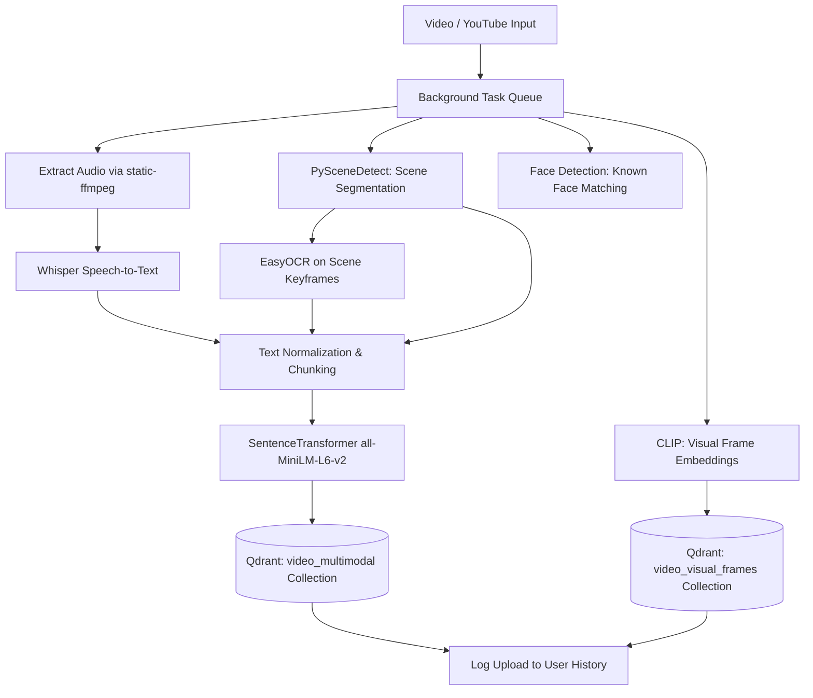
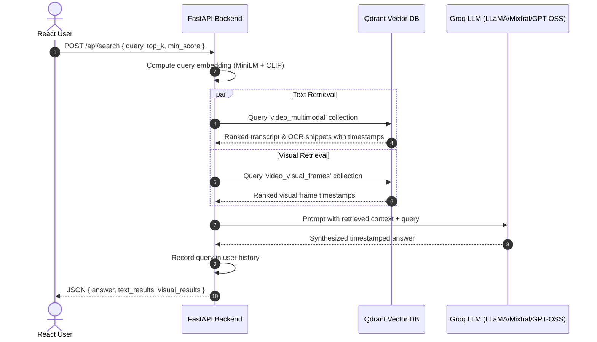

# 🎥 Video RAG Search Engine

[](https://fastapi.tiangolo.com/)
[](https://react.dev/)
[](https://qdrant.tech/)
[](https://groq.com/)
[](https://github.com/openai/whisper)
[](https://github.com/openai/CLIP)
[](https://firebase.google.com/)
[](LICENSE)

A production-grade, full-stack **Multimodal Video Retrieval-Augmented Generation (RAG) Search Engine**. Instead of scrubbing through hours of video, upload any video file or paste a YouTube URL, ask natural-language questions, and get precise timestamped moments along with an AI-generated concise answer.

> **Example Query:** *"Where does the speaker explain gradient descent and learning rate optimization?"*  
> **Result:** Exact timestamped clips (`02:14`, `06:42`) from transcript, slide text (OCR), visual frames, plus a synthesized LLM summary.

---

## 📑 Table of Contents

- [Key Features](#-key-features)
- [System Architecture](#-system-architecture)
- [How It Works](#-how-it-works)
  - [1. Multimodal Ingestion Pipeline](#1-multimodal-ingestion-pipeline)
  - [2. Search & RAG Generation Pipeline](#2-search--rag-generation-pipeline)
- [Tech Stack](#-tech-stack)
- [Project Directory Structure](#-project-directory-structure)
- [Getting Started](#-getting-started)
  - [Prerequisites](#prerequisites)
  - [Backend Setup](#backend-setup)
  - [Frontend Setup](#frontend-setup)
- [Environment Configuration](#-environment-configuration)
  - [Backend Configuration (`.env`)](#backend-configuration-env)
  - [Frontend Configuration (`frontend/.env`)](#frontend-configuration-frontendenv)
- [API Reference](#-api-reference)
- [Vector Collections Schema](#-vector-collections-schema)
- [Authentication & Multi-User Isolation](#-authentication--multi-user-isolation)
- [Testing & Maintenance](#-testing--maintenance)
- [Roadmap](#-roadmap)
- [Author & License](#-author--license)

---

## 🌟 Key Features

- **Multi-Source Video Input:** Upload local video files (`.mp4`, `.avi`, `.mov`, `.mkv`, `.webm`) or directly ingest any video using a **YouTube URL** via `yt-dlp`.
- **Speech Transcription:** Automatic speech-to-text with precise timestamps using **OpenAI Whisper** (`base` model).
- **Video Optical Character Recognition (OCR):** Extracts text from presentation slides, code editors, and on-screen graphics across detected scenes using **EasyOCR**.
- **Scene Detection & Frame Extraction:** Smart shot transition detection using **PySceneDetect** (`ContentDetector`) for scene-aware chunking.
- **Multimodal Vector Search:** Dual embedding index in **Qdrant**:
  - **Dense Text Embeddings:** `all-MiniLM-L6-v2` (384 dimensions) for speech transcripts and OCR text.
  - **Visual Image Embeddings:** `clip-ViT-B-32` (512 dimensions) for visual scene and frame-level matching.
- **Facial Recognition Support:** Recognizes pre-registered faces in video streams using `face_recognition` (dlib/OpenCV).
- **RAG Answer Generation:** Blazing-fast conversational synthesis using **Groq API** (powered by open models like `openai/gpt-oss-20b`), grounding answers with exact timestamps (`MM:SS`).
- **User Authentication & Privacy:** Secure **Firebase Auth** integration (Email/Password & Google Sign-In) with token verification in FastAPI.
- **Personalized Search & Upload History:** User-isolated activity logs, recent search queries, and real-time dashboard analytics (`data/history.json`).
- **Modern Responsive UI:** Built with **React 18**, **Vite**, **Tailwind CSS v4**, **Framer Motion**, and **Lucide Icons**.

---

## 🏗️ System Architecture

```text
                               ┌──────────────────────────────────────────────┐
                               │            React + Vite Frontend             │
                               │  (Dashboard, Upload, Search, History, Auth)  │
                               └──────────────────────┬───────────────────────┘
                                                      │ REST API + Bearer Token
                                                      ▼
                               ┌──────────────────────────────────────────────┐
                               │             FastAPI Backend API              │
                               │        (Auth Verification, Pipelines)        │
                               └───────┬──────────────────────────────┬───────┘
                                       │                              │
                    ┌──────────────────┴─────────────┐                │
                    │ Background Ingestion Pipeline  │                │
                    │                                │                │
        ┌───────────┼───────────────┬────────────────┼───────────┐    │
        │           │               │                │           │    │
        ▼           ▼               ▼                ▼           ▼    ▼
 ┌──────────┐ ┌───────────┐ ┌───────────────┐ ┌─────────────┐ ┌─────────────┐
 │ Whisper  │ │  EasyOCR  │ │ PySceneDetect │ │ CLIP Vision │ │    Groq     │
 │  Speech  │ │ Slide Text│ │ Scene Splits  │ │ ViT-B-32    │ │   LLM RAG   │
 └────┬─────┘ └─────┬─────┘ └───────┬───────┘ └──────┬──────┘ └──────┬──────┘
      │             │               │                │               │
      └──────┬──────┴───────────────┘                │               │
             ▼                                       │               │
  ┌───────────────────────┐                          │               │
  │ Context Aware Chunker │                          │               │
  │ + all-MiniLM-L6-v2    │                          │               │
  └──────────┬────────────┘                          │               │
             │ (384-dim)                             │ (512-dim)     │
             ▼                                       ▼               │
   ┌───────────────────────────────────────────────────┐             │
   │                Qdrant Vector DB                   │             │
   │  Collections: 'video_multimodal' & 'video_frames' │             │
   └─────────────────────────┬─────────────────────────┘             │
                             │ Dense Cosine Retrieval                │
                             └───────────────────────────────────────┘
```

---

## 🔄 How It Works

### 1. Multimodal Ingestion Pipeline

When a video is uploaded or a YouTube link is submitted:



1. **Audio Extraction:** `static-ffmpeg` strips audio into 16kHz WAV format.
2. **Speech Transcription:** OpenAI Whisper extracts spoken words and precise start/end timestamps.
3. **Scene Detection:** PySceneDetect identifies major shot transitions to anchor visual context.
4. **OCR Frame Analysis:** EasyOCR extracts text from slides, diagrams, and screen recordings.
5. **Smart Chunking:** Text from speech and OCR is merged chronologically with rolling overlap (`40` words, `10` word overlap).
6. **Vector Upsert:** Text chunks (384-dim) and CLIP visual frames (512-dim) are stored in Qdrant with rich payload metadata (`start`, `source`, `scene`, `video`).

---

### 2. Search & RAG Generation Pipeline



---

## 💻 Tech Stack

### Frontend
- **Framework:** [React 18](https://react.dev/) + [Vite 5](https://vitejs.dev/)
- **Styling:** [Tailwind CSS v4](https://tailwindcss.com/)
- **Animations:** [Framer Motion](https://www.framer.com/motion/)
- **Icons:** [Lucide React](https://lucide.dev/)
- **HTTP Client:** [Axios](https://axios-http.com/) (with Firebase JWT bearer token interceptor)
- **Routing:** [React Router DOM v6](https://reactrouter.com/)

### Backend
- **Framework:** [FastAPI](https://fastapi.tiangolo.com/) + [Uvicorn](https://www.uvicorn.org/)
- **LLM Engine:** [Groq](https://groq.com/) Cloud Inference
- **Vector Database:** [Qdrant](https://qdrant.tech/) (Cloud or Local On-Disk Engine)
- **Speech-to-Text:** [OpenAI Whisper](https://github.com/openai/whisper)
- **OCR:** [EasyOCR](https://github.com/JaidedAI/EasyOCR) + [OpenCV](https://opencv.org/)
- **Scene Detection:** [PySceneDetect](https://scenedetect.com/)
- **Embeddings:** [Sentence-Transformers](https://www.sbert.net/) (`all-MiniLM-L6-v2`, `clip-ViT-B-32`)
- **Video Processing & YouTube:** `yt-dlp`, `ffmpeg-python`, `static-ffmpeg`, `Pillow`
- **Face Recognition:** `face_recognition` (dlib)
- **Authentication:** `firebase-admin`, `google-auth`

---

## 📂 Project Directory Structure

```text
Video_Rag_Search_Engine/
├── backend/
│   ├── app/
│   │   ├── routes/
│   │   │   ├── __init__.py
│   │   │   ├── faces.py            # Face enrollment endpoints
│   │   │   ├── history.py          # User history & dashboard statistics
│   │   │   ├── search.py           # Multimodal vector search & RAG
│   │   │   └── upload.py           # Local file & YouTube background ingestion
│   │   │
│   │   ├── services/
│   │   │   ├── __init__.py
│   │   │   ├── auth.py             # Firebase ID token validation
│   │   │   ├── chunking.py         # Rolling window text chunker
│   │   │   ├── embeddings.py       # MiniLM (384d) & CLIP (512d) encoders
│   │   │   ├── face_recognition_service.py # dlib/OpenCV facial recognition
│   │   │   ├── history.py          # User analytics & JSON storage
│   │   │   ├── ocr.py              # EasyOCR scene keyframe text extractor
│   │   │   ├── rag.py              # Groq LLM context builder & generator
│   │   │   ├── scene_detection.py  # PySceneDetect scene segmenter
│   │   │   ├── text_cleaning.py    # Text normalizer & regex cleaner
│   │   │   ├── transcription.py    # OpenAI Whisper speech-to-text
│   │   │   ├── vector_store.py     # Qdrant client & collection manager
│   │   │   └── youtube.py          # yt-dlp YouTube video downloader
│   │   │
│   │   ├── config.py               # Central settings & directories
│   │   ├── main.py                 # FastAPI application factory & CORS
│   │   └── __init__.py
│   │
│   ├── Procfile                    # Deployment process configuration
│   └── requirements.txt            # Python dependencies
│
├── frontend/
│   ├── src/
│   │   ├── components/
│   │   │   ├── Layout.jsx          # App shell layout
│   │   │   ├── ProtectedRoute.jsx  # Auth guard component
│   │   │   └── Sidebar.jsx         # Navigation sidebar
│   │   ├── context/
│   │   │   └── AuthContext.jsx     # Firebase auth provider & state
│   │   ├── pages/
│   │   │   ├── Dashboard.jsx       # Overview, quick search, recent activity
│   │   │   ├── History.jsx         # Full search and upload timeline
│   │   │   ├── Login.jsx           # Firebase user login
│   │   │   ├── Profile.jsx         # User profile and stats
│   │   │   ├── SearchPage.jsx      # Multimodal search interface
│   │   │   ├── Signup.jsx          # Firebase user registration
│   │   │   └── UploadPage.jsx      # Video and YouTube URL upload
│   │   ├── api.js                  # Axios instance with auth interceptor
│   │   ├── App.jsx                 # Route definitions
│   │   ├── firebase.js             # Firebase client SDK initialization
│   │   ├── index.css               # Tailwind CSS stylesheet
│   │   └── main.jsx                # React DOM entrypoint
│   ├── package.json
│   └── vite.config.js
│
├── data/                           # Auto-created runtime storage (gitignored)
│   ├── uploads/                    # Incoming video storage
│   ├── audio/                      # Extracted WAV files
│   ├── frames/                     # Extracted scene keyframes
│   ├── transcripts/                # Exported text transcripts
│   ├── known_faces/                # Enrolled facial images
│   ├── qdrant_db/                  # Local Qdrant vector database
│   └── history.json                # User activity records
│
├── scripts/
│   └── clear_db.py                 # Utility script to reset Qdrant collections
├── tests/
│   └── test_api.py                 # Pytest API integration tests
│
├── .env                            # Backend environment secrets
├── .gitignore
├── LICENSE
├── pytest.ini
└── README.md
```

---

## 🚀 Getting Started

### Prerequisites

Ensure you have installed:
- **Python 3.10+**
- **Node.js (v18+) & npm**
- **FFmpeg** (installed locally or handled automatically via `static-ffmpeg`)
- **Git**

---

### Backend Setup

1. **Clone the repository:**
   ```bash
   git clone https://github.com/amityadav13a-prog/Video_Rag_Search_Engine.git
   cd Video_Rag_Search_Engine
   ```

2. **Create and activate a virtual environment:**
   - **Windows (PowerShell):**
     ```powershell
     python -m venv .venv
     .venv\Scripts\Activate.ps1
     ```
   - **macOS / Linux:**
     ```bash
     python3 -m venv .venv
     source .venv/bin/activate
     ```

3. **Install dependencies:**
   ```bash
   pip install -r backend/requirements.txt
   ```

4. **Set up backend environment variables:**  
   Create a `.env` file in the root directory (see [Environment Configuration](#-environment-configuration)).

5. **Start the FastAPI backend server:**
   ```bash
   uvicorn backend.app.main:app --host 127.0.0.1 --port 8000 --reload
   ```

   - API Home: [http://127.0.0.1:8000](http://127.0.0.1:8000)
   - Interactive Swagger Docs: [http://127.0.0.1:8000/docs](http://127.0.0.1:8000/docs)
   - ReDoc: [http://127.0.0.1:8000/redoc](http://127.0.0.1:8000/redoc)

---

### Frontend Setup

1. **Navigate to the frontend directory:**
   ```bash
   cd frontend
   ```

2. **Install npm dependencies:**
   ```bash
   npm install
   ```

3. **Configure frontend environment variables:**  
   Create a `frontend/.env` file with your Firebase configuration keys (see below).

4. **Start the Vite development server:**
   ```bash
   npm run dev
   ```

   - Access the Web App: [http://localhost:5173](http://localhost:5173)

---

## ⚙️ Environment Configuration

### Backend Configuration (`.env`)

Place `.env` in the repository root:

```env
# Groq API for Fast LLM RAG Generation
GROQ_API_KEY=gsk_your_groq_api_key_here

# Qdrant Vector DB (Cloud or Local)
# For Qdrant Cloud:
QDRANT_URL=https://your-cluster-url.qdrant.io
QDRANT_API_KEY=your_qdrant_api_key_here

# For Local Qdrant (Optional fallback if URL is empty):
# QDRANT_HOST=localhost
# QDRANT_PORT=6333

# Storage Optimization
# Set to 'true' to delete large raw video/audio files once embeddings are indexed
DELETE_VIDEO_AFTER_PROCESSING=true
```

### Frontend Configuration (`frontend/.env`)

Place `.env` inside `frontend/`:

```env
# Backend API Base URL
VITE_API_URL=http://127.0.0.1:8000/api

# Firebase Web App Credentials
VITE_FIREBASE_API_KEY=your_firebase_api_key
VITE_FIREBASE_AUTH_DOMAIN=your_project.firebaseapp.com
VITE_FIREBASE_PROJECT_ID=video-rag-search-engine
VITE_FIREBASE_STORAGE_BUCKET=your_project.appspot.com
VITE_FIREBASE_MESSAGING_SENDER_ID=your_messaging_sender_id
VITE_FIREBASE_APP_ID=your_firebase_app_id
```

---

## 📡 API Reference

### Health Checks
- `GET /` - Root status message.
- `GET /api/health` - Simple health check endpoint (`{"status": "ok"}`).

### Video Upload & Ingestion
- `POST /api/upload` - Upload a local video file (`multipart/form-data`). Starts background processing pipeline.
- `POST /api/upload/youtube` - Ingest video from YouTube URL (`{"url": "https://www.youtube.com/watch?v=..."}`).
- `GET /api/upload/status/{video_name}` - Returns real-time ingestion status and progress step.

### Search & RAG
- `POST /api/search` - Multimodal vector retrieval & RAG answer generation.
  **Request Body:**
  ```json
  {
    "query": "Where is the gradient descent formula explained?",
    "top_k": 5,
    "min_score": 0.20
  }
  ```
  **Response:**
  ```json
  {
    "answer": "Gradient descent is introduced at 02:14 where the objective function is minimized. Further details on the learning rate are given at 06:42.",
    "text_results": [
      {
        "timestamp": "02:14",
        "text": "gradient descent is an iterative optimization algorithm...",
        "source": "speech",
        "scene": 1,
        "score": 0.84
      },
      {
        "timestamp": "06:42",
        "text": "learning rate alpha controls the step size taken towards minimum",
        "source": "ocr",
        "scene": 4,
        "score": 0.79
      }
    ],
    "visual_results": [
      {
        "timestamp": "02:15",
        "score": 0.76
      }
    ]
  }
  ```

### User History & Analytics
- `GET /api/history` - Returns authenticated user's combined chronological upload and search history.
- `GET /api/history/stats` - Returns summary metrics (`videos_uploaded`, `searches_made`, `results_found`).

### Face Recognition
- `POST /api/faces/faces/add?name={person_name}` - Upload reference photo for face recognition (`multipart/form-data`).

---

## 🗄️ Vector Collections Schema

Qdrant is automatically configured on startup with two cosine similarity collections:

| Collection Name | Vector Dimension | Metric | Payload Contents | Description |
|---|---|---|---|---|
| `video_multimodal` | `384` | Cosine | `text`, `start`, `source` (`speech`/`ocr`), `scene`, `video` | Stores SentenceTransformer (`all-MiniLM-L6-v2`) text embeddings. |
| `video_visual_frames` | `512` | Cosine | `start`, `video` | Stores OpenAI CLIP (`clip-ViT-B-32`) visual scene frame embeddings. |

---

## 🔒 Authentication & Multi-User Isolation

1. **Client-Side Auth:** Users authenticate via Firebase Auth in React (Google OAuth or Email/Password).
2. **Token Transmission:** Axios automatically attaches the user's Firebase JWT via `Authorization: Bearer <token>` on all requests.
3. **Server-Side Verification:** FastAPI's `get_current_user` dependency uses `google.oauth2.id_token.verify_firebase_token` to securely extract the caller's unique `user_id`.
4. **Data Isolation:** Upload logs and search queries in `data/history.json` are partitioned per `user_id`, ensuring full privacy between users.

---

## 🧪 Testing & Maintenance

### Run Automated Tests
Execute the backend test suite using `pytest`:
```bash
pytest
```

### Reset / Clear Vector Database
To purge and recreate Qdrant collections:
```bash
python scripts/clear_db.py
```

---

## 🗺️ Roadmap

- [x] Multi-format video ingestion & YouTube support
- [x] Dual speech (Whisper) + OCR (EasyOCR) transcript indexing
- [x] Visual CLIP search across video frames
- [x] Fast RAG synthesis with Groq LLM
- [x] Firebase authentication with user-isolated history
- [ ] Direct in-browser video player with clickable jump-to-timestamp
- [ ] Multi-video cross-catalog search filters
- [ ] Redis + Celery distributed background worker queue
- [ ] Cloud Storage (AWS S3 / Google Cloud Storage) integration

---

## 👤 Author

**Amit Yadav**  
*AI / ML • Full-Stack Development • RAG • Computer Vision*  
GitHub: [@amityadav13a-prog](https://github.com/amityadav13a-prog)

---

## 📄 License

This project is licensed under the **MIT License** - see the [LICENSE](LICENSE) file for details.
